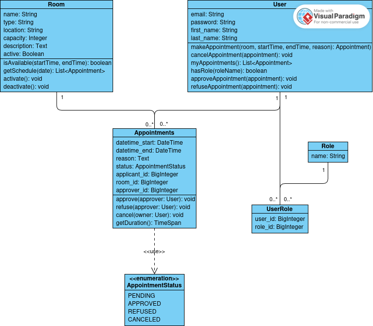

# Documentação do Projeto

Lívia Helena Rosa Scopel e Samuel Bagatelli Sampaio

<!-- DIAGRAMA DE CLASSES -->

## Diagrama de Classes



<!-- FERRAMENTAS ESCOLHIDAS -->

## Ferramentas escolhidas

- Versionamento e compartilhamento de código: Git
- Build: N/A
- Testes: Pytest
- Issue tracking: Github
- CI/CD: Github Actions
- Container: Docker

<!-- FRAMEWORKS UTILIZADOS -->

## Frameworks Utilizados

- Quasar (frontend)
- FastAPI (backend)
- Alembic e SQLAlchemy (banco de dados)

<!-- COMO GERAR A DOCUMENTAÇÃO -->

## Como gerar a Documentação do código

O FastAPI possui uma documentação interativa da API, o Swagger UI.

### Como acessar?

Ao rodar a aplicação, a documentação estará disponível pelo link http://127.0.0.1:8000/docs

<!-- COMO EXECUTAR O SISTEMA -->

## Como executar o Sistema

1. Clone o repositório

   ```sh
   git clone https://github.com/sbsampaio/agenda-ct.git
   cd agenda-ct
   ```

2. Inicie um ambiente virtual

   ```sh
   python3 -m venv .venv
   ```

3. Ative o ambiente virtual no seu terminal

   ```sh
   source .venv/bin/activate
   ```

4. Instale as dependências do projeto

   ```sh
   pip install -r requirements.txt
   ```

5. Crie o arquivo `.env`

   ```sh
   cat app/settings/.env.example > app/settings/.env
   ```

6. Modifique o arquivo `.env`, inserindo as variáveis corretas

7. ROde a aplicação (no modo dev)

   ```sh
   fastapi dev app/main.py
   ```
